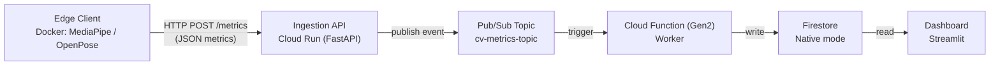

# Cloud-Native CV Benchmarking Platform

## Abstract

This project presents a cloud-native, event-driven benchmarking platform for pose-estimation systems operating in edge-to-cloud environments. The platform decouples local computer vision inference from cloud-side aggregation and visualization, enabling realistic performance evaluation without transmitting raw video data. By combining containerized edge execution with managed cloud services, the system provides a reproducible and framework-agnostic basis for comparing runtime performance, resource usage, and detection quality across different pose-estimation frameworks. The architecture emphasizes separation of concerns, least-privilege security, and configuration-driven reproducibility, making it suitable both as a research artifact and as a reference implementation for edge–cloud computer vision pipelines.

---

## Research Context and Motivation

This project builds upon existing research in distributed computer vision and event-driven architectures. The platform addresses the edge-to-cloud data gap by implementing a decoupled, scalable pipeline.

### Edge vs. Cloud Trade-offs in Real-time AI

Research consistently highlights that while Cloud AI offers superior computational resources, it suffers from network latency and bandwidth costs. Conversely, edge computing excels in real-time processing and data privacy.

**Key Finding:** Hybrid models that perform inference at the edge and analytical aggregation in the cloud provide the best trade-off for IoT-scale deployments.

Source:
[Benchmarking Edge Computing vs. Cloud Computing for Real-Time Data Processing (2025)](https://www.researchgate.net/publication/389356968_Benchmarking_Edge_Computing_vs_Cloud_Computing_for_Real-Time_Data_Processing)

### Event-Driven Architectures for Real-Time Analytics

Modern IoT systems increasingly rely on event-driven architectures (EDA) instead of synchronous database writes. Message brokers decouple producers from consumers, improving fault tolerance and scalability.

**Key Finding:** Asynchronous communication prevents high-frequency telemetry from overwhelming backend services and enables responsive dashboards under bursty workloads.

Source:
[Event-Driven Architectures for Real-Time Data Processing: A Deep Dive (2025)](https://www.researchgate.net/publication/391633680_Event-Driven_Architectures_for_Real-Time_Data_Processing_A_Deep_Dive_into_System_Design_and_Optimization)

---

## System Overview and Architecture

At a high level, the platform separates responsibilities based on where they can be handled most effectively.

**Edge layer (local execution):**

* Performs pose-estimation inference
* Processes raw video locally
* Computes structured performance metrics

**Cloud layer (managed services):**

* Ingests metrics asynchronously
* Aggregates and persists results
* Enables cross-run comparison and visualization

Only low-volume, structured metric events cross the edge–cloud boundary. Raw video data never leaves the edge device, avoiding bandwidth costs and cloud-induced variability.

### Architectural Rationale

The system follows a strict event-driven design. Edge components act solely as event producers. All cloud components operate as asynchronous consumers. Failures or slowdowns in downstream services do not affect local inference.

### Component Interaction Flow

```
Edge Client → Ingestion API → Pub/Sub → Cloud Worker → Firestore → Dashboard
```



Each component has a single responsibility. Edge containers never access cloud databases, and cloud services never perform inference.

---

## Design Principles

### Core Principles

**Event-driven communication**
All edge-to-cloud communication is asynchronous. Edge containers emit self-contained metric events that are processed independently by cloud services.

**Stateless services**
All cloud services are stateless. Persistent state is handled exclusively by managed services.

**Separation of concerns**

* Edge: inference and metric generation
* Ingestion API: validation and transport
* Worker: persistence
* Dashboard: read-only visualization

**Environment-based configuration**
All configuration is injected via environment variables. No values are hard-coded into images or source code.

**Reproducibility by construction**
Containerized execution, fixed architectural constants, and explicit configuration boundaries ensure repeatable experiments.

---

## Environment Configuration Model

All components are configured exclusively via environment variables. Configuration scopes are strictly separated.

### Configuration Scopes

* **Edge (Docker):** `env/common.env`, `env/mediapipe.env`, `env/openpose.env`
* **Cloud:** injected at deploy time via `gcloud --set-env-vars`

### Required Variables

#### User-provided (Edge)

| Variable      | Used by | Where            | Description                                       |
| ------------- | ------- | ---------------- | ------------------------------------------------- |
| `INGEST_URL`  | Edge    | `env/common.env` | Cloud Run ingestion endpoint including `/metrics` |
| `SOURCE_NAME` | Edge    | `env/common.env` | Human-readable identifier for the run             |

#### Deployment-only (Cloud)

| Variable               | Used by           | Where           | Description              |
| ---------------------- | ----------------- | --------------- | ------------------------ |
| `GOOGLE_CLOUD_PROJECT` | Ingestion API     | Cloud Run       | Required for Pub/Sub     |
| `FIRESTORE_DATABASE`   | Worker, Dashboard | Functions / Run | Explicit Firestore DB ID |

All other variables are pre-filled with safe defaults and must not be changed unless container internals are modified.

---

## Cloud Layer

This section must be completed **before** configuring or running any edge containers. The `INGEST_URL` required by the edge layer is only available after deploying the ingestion API.

> Docker `.env` files are never used by Cloud Run or Cloud Functions.

### Cloud Infrastructure Setup (one-time)

#### Enable APIs

```bash
gcloud services enable \
  cloudfunctions.googleapis.com \
  run.googleapis.com \
  artifactregistry.googleapis.com \
  cloudbuild.googleapis.com \
  pubsub.googleapis.com \
  firestore.googleapis.com \
  eventarc.googleapis.com \
  --project=clc-group-vision-2026
```

#### Create Pub/Sub topic

```bash
gcloud pubsub topics create cv-metrics-topic \
  --project=clc-group-vision-2026
```

#### Create Firestore database

* Mode: Native
* Region: europe-west3
* Database ID: `clc-group-vision-2026`

---

### Ingestion API (Cloud Run)

Stateless FastAPI service that validates metrics and publishes them to Pub/Sub.

**Required environment variables**

| Variable               | Value                   |
| ---------------------- | ----------------------- |
| `GOOGLE_CLOUD_PROJECT` | `clc-group-vision-2026` |

---

#### Deploy

```bash
cd src/backend

gcloud run deploy ingestion-api \
  --source . \
  --region europe-west3 \
  --allow-unauthenticated \
  --set-env-vars GOOGLE_CLOUD_PROJECT=clc-group-vision-2026
```

> **Note on access control**
> The effect of `--allow-unauthenticated` is **CLI- and version-dependent**.
> To guarantee that the ingestion API is not publicly accessible, public invocation rights must be explicitly revoked after deployment.

```bash
gcloud run services remove-iam-policy-binding ingestion-api \
  --region europe-west3 \
  --project clc-group-vision-2026 \
  --member="allUsers" \
  --role="roles/run.invoker"
```

> **Required IAM role**
> Edge clients must authenticate using a service account with the role:
>
> * `roles/run.invoker` on the `ingestion-api` Cloud Run service
>
> All unauthenticated requests are rejected.

After deployment, copy the HTTPS URL and set:

```env
INGEST_URL=https://<cloud-run-url>/metrics
```

---
### Cloud Worker (Cloud Functions Gen2)

Consumes Pub/Sub events and writes them to Firestore.

**Required environment variables**

| Variable             | Value                   |
| -------------------- | ----------------------- |
| `FIRESTORE_DATABASE` | `clc-group-vision-2026` |

#### Deploy

```bash
cd src/worker

gcloud functions deploy process-metrics-worker \
  --gen2 \
  --region europe-west3 \
  --runtime python310 \
  --source . \
  --entry-point subscribe \
  --trigger-topic cv-metrics-topic \
  --project clc-group-vision-2026 \
  --set-env-vars FIRESTORE_DATABASE=clc-group-vision-2026
```

---

### Dashboard (Cloud Run)

Read-only Streamlit dashboard querying Firestore.

#### Run locally

```bash
pip install streamlit pandas google-cloud-firestore

gcloud auth application-default login
gcloud config set project clc-group-vision-2026

streamlit run src/dashboard/app.py
```

#### Deploy

```bash
cd src/dashboard

gcloud run deploy clc-vision-dashboard \
  --source . \
  --region europe-west3 \
  --allow-unauthenticated \
  --set-env-vars FIRESTORE_DATABASE=clc-group-vision-2026
```
---
## Edge Layer

This section assumes that **all Cloud components are already deployed** and that the `INGEST_URL` of the ingestion API is known. The edge layer cannot be configured or executed correctly before the cloud layer is fully operational.

The edge layer is responsible for all computationally intensive computer vision processing and is executed entirely on the local machine. It performs pose-estimation inference, computes performance and quality metrics, and emits structured metric events to the cloud ingestion API.

---

### Supported Frameworks

Two pose-estimation frameworks are supported:

* **MediaPipe Pose**

  * Executed via the MediaPipe Tasks API
  * Requires an explicit `.task` model file
* **OpenPose**

  * Executed via a compiled CPU-only binary

Both frameworks follow the same execution contract:

* read videos from a mounted dataset directory
* process frames sequentially
* compute standardized metrics
* emit JSON metric events to the ingestion API

---

### Containerization Strategy

Each framework is packaged in its own Docker image. This separation is intentional and avoids dependency conflicts, in particular incompatible protobuf and native library versions between MediaPipe and Google Cloud SDKs.

All edge containers:

* are stateless
* receive configuration exclusively via environment variables
* mount input data and output directories as volumes
* authenticate to Cloud Run using a mounted service account key
* never access cloud databases or Pub/Sub directly

---

### Required Local Configuration

This section assumes the repository is already present on your machine and that you are located at the repository root.

```bash
pwd   # must point to repository root
```

The edge layer uses three local environment files:

* `env/common.env` (shared across frameworks)
* `env/mediapipe.env` (MediaPipe-specific)
* `env/openpose.env` (OpenPose-specific)

Only `env/common.env` must be created manually.

Create it by copying the example file:

```bash
cp env/common.env.example env/common.env
```

Open `env/common.env` and set at least:

* `INGEST_URL` — HTTPS endpoint of the Cloud Run ingestion API including `/metrics`
* `SOURCE_NAME` — human-readable identifier for this run (appears in all stored metrics)

All other variables must remain unchanged unless Docker volume mounts or container internals are modified intentionally.

---

### MediaPipe Task Model (Required)

MediaPipe Pose **does not ship with a model**. The required `.task` file must be downloaded manually and placed in the expected location inside the repository.

#### Download the model

Download the official MediaPipe Pose Landmarker model:

* Source: [https://storage.googleapis.com/mediapipe-models/pose_landmarker/pose_landmarker_heavy/float16/latest/pose_landmarker_heavy.task](https://storage.googleapis.com/mediapipe-models/pose_landmarker/pose_landmarker_heavy/float16/latest/pose_landmarker_heavy.task)

+ Information: [https://ai.google.dev/edge/mediapipe/solutions/vision/pose_landmarker?hl=de#models](https://ai.google.dev/edge/mediapipe/solutions/vision/pose_landmarker?hl=de#models)
Recommended file:

```
pose_landmarker_heavy.task
```

#### Place the model file

Copy the `.task` file into the MediaPipe extraction module:

```text
src/extract_pose_mediapipe/pose_landmarker_heavy.task
```

The path is referenced via environment variables inside `env/mediapipe.env`.
If the file is missing or misnamed, the MediaPipe container will fail at startup.

No model download occurs at runtime. This is intentional to ensure reproducibility and offline execution.

---

### Edge Authentication (Service Account Key)

Edge containers authenticate to the Cloud Run ingestion API using a **dedicated Google Cloud service account**. Authentication is based on short-lived identity tokens derived from a locally mounted JSON key file.

Before creating the key, **verify your local gcloud state**.

#### Preflight checks (mandatory)

Ensure you are authenticated:

```bash
gcloud auth list
```

Ensure the correct project is active:

```bash
gcloud config get-value project
```

If necessary, set it explicitly:

```bash
gcloud config set project clc-group-vision-2026
```

Key creation will fail or silently target the wrong project if this is not correct.

---

#### Required IAM roles (minimum)

The edge service account requires **exactly one permission**:

* `roles/run.invoker` on the **ingestion API Cloud Run service**

No access to Pub/Sub, Firestore, or other resources is required or allowed.

---

#### Create the service account

```bash
gcloud iam service-accounts create edge-ingestor \
  --project=clc-group-vision-2026
```

#### Grant Cloud Run invoker permission

```bash
gcloud run services add-iam-policy-binding ingestion-api \
  --region europe-west3 \
  --project clc-group-vision-2026 \
  --member="serviceAccount:edge-ingestor@clc-group-vision-2026.iam.gserviceaccount.com" \
  --role="roles/run.invoker"
```

#### Create the JSON key file

The key **must** be written directly into the expected secrets path:

```bash
gcloud iam service-accounts keys create env/secrets/edge-ingestor-key.json \
  --project=clc-group-vision-2026 \
  --iam-account=edge-ingestor@clc-group-vision-2026.iam.gserviceaccount.com
```

Expected local path:

```text
env/secrets/edge-ingestor-key.json
```

Docker Compose mounts this file into the container.
`env/common.env` sets `GOOGLE_APPLICATION_CREDENTIALS` to the in-container path.

---

### Running Edge Containers

Each edge container run is fully self-contained. Cloud-side failures do not interrupt local inference. Containers can be stopped and restarted safely.

#### MediaPipe

```bash
cd src/extract_pose_mediapipe/docker
docker compose build
docker compose run --rm mediapipe_extract_pose
```

#### OpenPose

```bash
cd src/extract_pose_openpose/docker
docker compose build
docker compose run --rm openpose-cpu
```

If execution is interrupted manually, clean up with:

```bash
docker compose down
```

from the same directory.

---

## Security Model

This section summarizes how authentication, authorization, and secret handling are implemented across the platform, with a strict focus on least-privilege and separation of concerns.

Authentication between edge and cloud is based on Google Cloud service accounts. Edge containers authenticate to the ingestion API using short-lived identity tokens derived from a mounted service account key. No static API keys or hard-coded credentials are used. Cloud-side services authenticate implicitly via their attached runtime identities.

Authorization is scoped per component. Edge clients are granted only the `roles/run.invoker` permission on the ingestion API and have no access to Pub/Sub, Firestore, or other cloud resources. The ingestion API can publish messages to Pub/Sub but cannot write to Firestore. The worker can write to Firestore but cannot be invoked directly. The dashboard has read-only access to Firestore and no permissions to modify data or receive events.

Secrets are handled exclusively via environment variables and mounted files. Service account keys are never baked into container images or committed to the repository. Local secret files are ignored by version control and are injected at runtime via Docker volume mounts or cloud deployment configuration.

This layered security model ensures that a compromise of any single component does not grant broader system access. Each service operates with the minimum permissions required to fulfill its role, and configuration boundaries between edge and cloud prevent accidental credential leakage.

---

## Reproducibility Strategy

Reproducibility in this platform is achieved by constraining execution paths and configuration sources at every layer of the system. All edge-side computation is executed inside explicitly versioned Docker containers, ensuring identical runtime environments across machines and operating systems. Configuration is injected exclusively via environment variables with clearly separated scopes for edge and cloud components, eliminating hidden defaults and cross-layer leakage. Cloud services are stateless and fully defined by their deployment commands, while fixed topic names, database identifiers, and deterministic processing logic ensure that repeated runs with the same inputs produce comparable results. Together, these measures allow experiments to be reproduced end-to-end using only the repository state and documented commands.

---

## Evaluation and Metrics

This section describes the metrics collected by the edge layer, explains how they are aligned across different pose-estimation frameworks, and clarifies their role in enabling fair and reproducible benchmarking. All metrics are computed locally during inference and emitted as structured events, ensuring that cloud-side processing does not influence measured performance.

The following table summarizes the core metric categories collected for each video and explains their purpose in the evaluation:

| Metric Category     | Examples                                                | Purpose in Benchmarking                                                |
| ------------------- | ------------------------------------------------------- | ---------------------------------------------------------------------- |
| Runtime performance | wall-time, effective FPS, CPU utilization               | Quantifies computational efficiency and throughput on edge devices     |
| Resource usage      | peak RSS memory, memory delta                           | Captures hardware resource demands independent of cloud infrastructure |
| Detection quality   | detection rate, mean visibility, confidence percentiles | Approximates pose-estimation robustness and output consistency         |
| Inference latency   | per-frame latency percentiles (where available)         | Enables comparison of temporal behavior across frameworks              |
| Metadata            | framework, model variant, run ID, source name           | Ensures traceability and comparability across runs                     |

By enforcing a common metric schema for MediaPipe and OpenPose, the platform allows direct comparison despite differences in internal representations. Metrics are aggregated and visualized without further transformation, preserving the integrity of the original measurements.

---

## Lessons Learned

The development of this benchmarking platform provided several key insights regarding security, data integrity, and container orchestration:

1. Security and Authentication
Authentication is Essential: Implementing robust authentication was critical for the secure communication between the edge clients and the Google Cloud backend. This ensures that only authorized metrics are ingested into the pipeline and prevents unauthorized access to the cloud infrastructure.

2. Data Integrity and Comparison
Standardized Metrics for Comparison: For a benchmarking platform to be effective, there must be a unified set of metrics across all tested models. Standardizing how performance is measured ensures that the comparison between different CV frameworks remains meaningful and consistent.

3. Container Orchestration
Path Management via Volume Mounts: Proper configuration of Volume Mounts is vital when working with containerized CV models. We learned that precise path management is necessary to ensure the containers can access local video datasets and write output logs without permission or directory errors.

4. Protobuf Versioning & Dependency Isolation
Managing Dependency Conflicts: We encountered significant "Dependency Hell" because MediaPipe requires older versions of protobuf, while the Google Cloud client libraries require the latest versions.

The Microservices Solution: Decoupling the Edge Client from the Backend into separate virtual environments or Docker containers was the only viable way to resolve these conflicts without breaking core functionality.
---

## Limitations

The current system has several limitations that should be considered when interpreting the results:

* **Single-cloud dependency:** The platform is tightly coupled to Google Cloud services (Cloud Run, Pub/Sub, Firestore). Porting to another cloud provider would require non-trivial changes to the infrastructure layer.
* **Limited model scope:** Only MediaPipe Pose and OpenPose are evaluated. Results do not generalize automatically to other pose-estimation frameworks or tasks.
* **CPU-only inference:** All benchmarks are performed using CPU-based inference. GPU acceleration, which is common in production deployments, is not covered.
* **Dataset assumptions:** The system assumes a static, locally available video dataset with a predefined manifest. Streaming inputs and live camera feeds are out of scope.
* **Metric approximations:** Some quality metrics (e.g., visibility and confidence proxies) are framework-specific approximations and do not represent ground-truth accuracy.
* **No automated failure recovery:** While the system is resilient to partial failures, there is no retry or dead-letter handling for malformed events or persistent cloud-side errors.

---

## Conclusion

This project demonstrates how pose-estimation benchmarking can be structured as a cleanly separated, event-driven edge–cloud system. By isolating inference, ingestion, processing, persistence, and visualization into well-defined components, the platform enables reproducible and framework-agnostic performance evaluation without coupling measurement results to cloud-side execution. Beyond the concrete MediaPipe and OpenPose comparison, the architecture serves as a general blueprint for evaluating computer vision workloads in realistic edge-to-cloud settings, where scalability, security, and reproducibility are equally critical.
