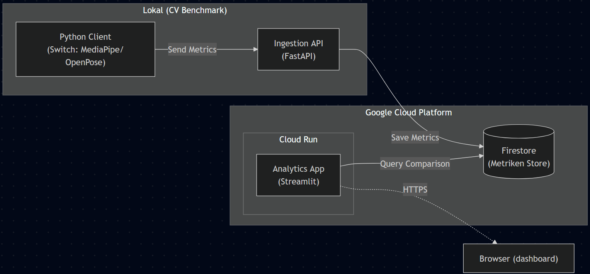

# Projektproposal: Cloud-Native CV Benchmarking Platform

## 1. Ziel des Projekts
Das Ziel ist die Entwicklung einer  **hybriden Cloud-Plattform** von Computer-Vision-Modellen. Wir verbinden ein lokales von uns entwickeltes Modul, das Gesten/Übungen erkennt (**Edge Computing**) (Vergleich von MediaPipe vs. OpenPose), mit einer Cloud-Computing (zentrale Analyse).

Konkret läuft die Bildverarbeitung (MediaPipe vs. OpenPose) lokal auf dem Gerät (Edge), um Bandbreite zu sparen. Nur die Analyse-Ergebnisse (Telemetrie wie Latenz, CPU-Last, Konfidenz) werden an die Cloud gesendet, dort gespeichert und visualisiert.

### Was wird neu gebaut vs. was existiert?
* **Existiert:** Wir nutzen die Frameworks **OpenPose/MediaPipe** (aus dem CV-Kurs) und Google Cloud Services (Cloud Run, Firestore).
* **Wird neu gebaut:**
    * **Edge Client (Python/Docker):** Ein Container, der lokal auf dem Laptop läuft, die Webcam ausliest, die Pose erkennt und nur die *Metriken* (nicht das Video) an die Cloud sendet.
    * **Cloud API (FastAPI):** Ein Microservice in der Cloud, der die Metriken empfängt.
    * **Cloud Dashboard (Streamlit):** Eine Webseite, die live anzeigt, welches Modell gerade besser performt (z.B. "MediaPipe ist 20% schneller als OpenPose"), inklusive Dashboard mit darstellung verschiedenster Metriken der Machine Learning Modelle und verwendeten Cloud Ressourcen.

## 2. High-Level Architektur

Wir nutzen eine **Microservice-Architektur** auf Basis von Containern.

## 3. Beziehung zu Cloud Computing

Das Projekt zeigt eine typische IoT-Architektur (Internet of Things):
* **Edge Computing:** Die KI-Berechnung findet "am Rand" des Netzwerks (Laptop) statt, um Latenz zu minimieren
* **Microservices**: API und Dashboard sind getrennte Services in der Cloud.
* **Containerization**: Wir nutzen Docker sowohl lokal (für Reproduzierbarkeit der CV-Umgebung) als auch in der Cloud (für das Deployment).
* **Serverless**: Die Cloud-Komponenten laufen auf Google Cloud Run und skalieren automatisch.

## 4. Meilensteine

Start der Implementierung nach der Proposal-Abnahme (Weihnachtsferien/Jänner).

| Meilenstein | Beschreibung & Ziel | Deadline (Intern) |
| :--- | :--- | :--- |
| **M1: Cloud Setup** | GCP Projekt, Terraform-Basis und Docker-Registry eingerichtet. | 30.12.2025 |
| **M2: Ingestion Service** | FastAPI-Container läuft. Er akzeptiert JSON-Pakete mit Metriken (z.B. `{"model": "OpenPose", "latency": 45ms}`). | 07.01.2026 |
| **M3: Dashboard Skeleton** | Streamlit-App visualisiert Dummy-Daten. Layout für den Vergleich (Split-Screen: OpenPose vs. MediaPipe) steht. | 14.01.2026 |
| **M4: Integration & Metrics** | Der echte CV-Client sendet Live-Daten. Dashboard zeigt nun echte Kurven zu CPU-Usage und FPS an. | 21.01.2026 |
| **M5: Cloud Monitoring** | Hinzufügen von Metriken zur Cloud-Performance (z.B. "Wie lange dauert ein Datenbank-Write?"). Finalisierung für Demo. | 28.01.2026 |
| **M6: Finalisierung** | Doku, Code-Cleanup und Vorbereitung für Präsentation. | 31.01.2026 |

## 5. Aufgabenverteilung

| Teammitglied | Rolle | Verantwortungsbereich |
| :--- | :--- | :--- |
| **Christoph** | **Cloud Backend** | Programmierung der Cloud-API (FastAPI) und Deployment in Google Cloud Run.  |
| **Simon** | **Infra & Data** | Datenbank-Setup (Firestore), Terraform (Infrastructure as Code) und CI/CD. |
| **Marco** | **Edge & Viz** | Integration der CV-Modelle (OpenPose/MediaPipe), Senden der Metriken und Bau der Streamlit-Charts. |