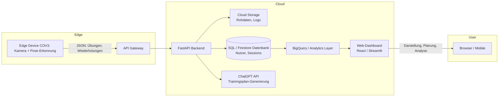

# Projektvorschlag: Cloud-basierte Fitness-Tracking- und Analyseplattform

## Ziel des Projekts

Das Ziel dieses Projekts ist die Entwicklung einer Cloud-basierten Webplattform, die Trainingsdaten aus dem bestehenden COV3-Fitness-Tracker zentral sammelt, speichert, analysiert und visuell aufbereitet. Durch die Integration einer KI-Komponente werden personalisierte Trainingspläne erstellt, die sich dynamisch an die Leistungsdaten des Nutzers anpassen. Das System verbindet lokale Datenerfassung mit Cloud-gestützter Verarbeitung und Analyse, um ein skalierbares, intelligentes Fitness-Ökosystem zu schaffen.

## High-Level Ziel

Das Projekt soll eine vollständige Cloud-Architektur bereitstellen, die als Erweiterung des bestehenden lokalen Trackers fungiert. Die Plattform dient als historisches Tracking- und Analysesystem, das automatisch Fortschritte erfasst und visuell darstellt. Zusätzlich werden Trainingspläne generiert, die auf realen Nutzungsdaten basieren. Der Fokus liegt auf der Verbindung von Edge-Computing (lokale Pose-Erkennung) und Cloud-Computing (Datenanalyse, Speicherung, KI-gestützte Planung).

## Neuerungen und bestehende Komponenten

Bereits vorhanden ist das COV3-Projekt: eine lokale Anwendung zur Echtzeit-Übungserkennung und Wiederholungszählung mittels MediaPipe. Neu entwickelt werden eine Cloud-API zur Datenerfassung, eine zentrale Datenbank zur Speicherung der Trainingshistorie, ein Dashboard zur Visualisierung sowie eine ChatGPT-Integration zur Erstellung individueller Trainingspläne.

## High-Level Architektur

## Bezug zu Cloud Computing

Das Projekt nutzt Cloud-Technologien auf mehreren Ebenen. Über **Cloud Run** (bzw. AWS Lambda) wird ein serverloses Backend betrieben, das Skalierbarkeit und geringe Wartungskosten ermöglicht. **Cloud Storage** dient zur sicheren Ablage von Nutzerdaten, **BigQuery** bzw. eine vergleichbare Analytik-Plattform übernimmt die Aggregation und Auswertung der Trainingshistorie. Über **APIs** werden KI-Modelle (ChatGPT) in den Workflow integriert, um die Analysedaten für personalisierte Trainingsvorschläge zu nutzen. Das Frontend wird auf einer Cloud-Plattform (z. B. Firebase Hosting oder Vercel) bereitgestellt. Damit erfüllt das Projekt zentrale Cloud-Computing-Prinzipien wie Elastizität, Verfügbarkeit, serverlose Architektur und datengetriebene Dienste.

## Milestones

| Meilenstein | Inhalt                                                      | Geplanter Abschluss |
| ----------- | ----------------------------------------------------------- | ------------------- |
| M1          | Projektsetup, Architekturdefinition, CI/CD-Umgebung         | 10.10.              |
| M2          | Implementierung der Cloud-API und Datenbankanbindung        | 17.10.              |
| M3          | Integration des Edge-Trackers mit Cloud-API                 | 24.10.              |
| M4          | Entwicklung der KI-Komponente (ChatGPT API, Trainingspläne) | 31.10.              |
| M5          | Aufbau des Dashboards (Visualisierung der Daten)            | 07.11.              |
| M6          | Analytics Layer und automatisiertes Reporting               | 14.11.              |
| M7          | Abschluss, Dokumentation, Präsentation, Live-Demo           | 21.11.              |

## Aufgabenverteilung

| Teammitglied  | Verantwortungsbereich             | Beschreibung                                                                                                        |
| ------------- | --------------------------------- | ------------------------------------------------------------------------------------------------------------------- |
| **Christoph** | Cloud-Backend und KI-Integration  | Architekturdesign, Implementierung der API, ChatGPT-Anbindung, Modell-Integration, CI/CD.                           |
| **Marco**     | Frontend und Datenanalyse         | Entwicklung des Dashboards, Datenvisualisierung, Weboberfläche, Anbindung an die Datenbank und den Analytics-Layer. |
| **Simon**     | Datenmanagement und Infrastruktur | Datenbankmodellierung, Speicherung, Deployment auf Cloud-Plattform, Logging, Monitoring und Sicherheit.             |

## Zusammenfassung

Dieses Projekt zeigt die Verbindung eines bestehenden KI-basierten Edge-Systems mit modernen Cloud-Technologien. Durch die Erweiterung um eine Cloud-Plattform wird aus einer lokalen Anwendung ein skalierbares, datengetriebenes System, das Trainingsfortschritte erfasst, auswertet und durch KI personalisierte Empfehlungen bereitstellt. Es erfüllt die zentralen Anforderungen an ein Cloud-Computing-Projekt, indem es reale Datenverarbeitung, Cloud-Architektur, Serverless-Technologie und KI-Integration in einem praxisorientierten Anwendungsszenario vereint.
