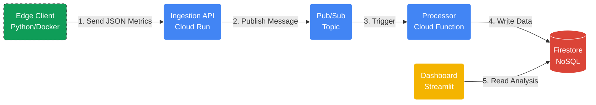

# Projektproposal: Scalable Cloud-Native CV Benchmarking Platform

## 1. Ziel des Projekts und Motivation

Das Kernziel ist die Entwicklung einer **hybriden Benchmarking-Plattform** für Computer-Vision-Modelle, die lokale Inferenz (**Edge Computing**) mit einer skalierbaren **Cloud-Analyse** verbindet.

Wir vergleichen dabei nicht nur die Performance von Modellen (MediaPipe vs. OpenPose), sondern erforschen primär, wie eine moderne **ereignisgesteuerte Architektur (Event-Driven Architecture)** für IoT-Daten aufgebaut sein muss.

### Erkenntnisgewinn & Technische Motivation
Um über das bloße Speichern von Daten hinauszugehen, adressieren wir folgende Aspekte:

* **Warum diese Cloud-Technologien? (Vorteile):**
    * **Entkopplung & Skalierbarkeit:** Durch den Einsatz von **Google Pub/Sub** entkoppeln wir die Datenerfassung von der Verarbeitung. Das System wird robust gegen Lastspitzen (z.B. wenn tausende Clients gleichzeitig senden), da die Queue puffert.
    * **Serverless Operations:** Die Nutzung von **Cloud Run** und **Cloud Functions** minimiert den administrativen Aufwand (NoOps) und ermöglicht ein "Pay-per-Use" Kostenmodell.
    * **Managed Data:** Firestore bietet als NoSQL-Lösung die nötige Flexibilität für sich ändernde Metrik-Strukturen der ML-Modelle.

* **Herausforderungen & Schwierigkeiten:**
    * **Asynchrone Konsistenz:** Da Daten nicht synchron in die DB geschrieben werden ("Fire and Forget" an die Queue), entsteht "Eventual Consistency". Das Dashboard muss damit umgehen, dass Daten evtl. mit leichter Verzögerung sichtbar werden.
    * **Latenz-Overhead:** Eine Schwierigkeit liegt darin, die Netzwerklatenz zwischen Edge und Cloud so gering zu halten, dass die Performancemessung der eigentlichen CV-Modelle nicht verfälscht wird.

## 2. High-Level Architektur

Wir setzen auf eine asynchrone Microservice-Architektur, um "Enterprise Patterns" im kleinen Maßstab abzubilden.

### Architektur-Komponenten
* **Edge Layer:** Ein Docker-Container führt die Bildverarbeitung lokal aus (Privatsphäre & Bandbreite) und extrahiert Metriken.
* **Ingestion Layer:** Eine **FastAPI** auf **Cloud Run** dient als Eintrittstor.
* **Messaging Layer (Neu):** **Pub/Sub** nimmt Nachrichten entgegen und puffert sie.
* **Processing Layer (Neu):** Eine **Cloud Function** wird durch Pub/Sub getriggert, validiert die Daten und schreibt sie final in die Datenbank.
* **Presentation Layer:** Ein **Streamlit** Dashboard visualisiert die Live-Daten.

## 3. Beziehung zu Cloud Computing

Das Projekt demonstriert wesentliche Cloud-Paradigmen:
* **Event-Driven Architecture:** Nutzung von Message Queues zur Systementkopplung statt direkter HTTP-Calls an die Datenbank.
* **FaaS (Function as a Service):** Granulare Verarbeitung von Events durch Cloud Functions (Trigger-based).
* **Infrastructure as Code (IaC):** Bereitstellung der Infrastruktur (Topics, Services, IAM) via Terraform.
* **Edge Computing:** Verlagerung rechenintensiver Aufgaben auf den Client zur Latenzminimierung.

## 4. Meilensteine

Start der Implementierung nach der Proposal-Abnahme.

| Meilenstein | Beschreibung & Ziel | Deadline |
| :--- | :--- | :--- |
| **M1: Cloud Infra** | Terraform Setup für Cloud Run, Pub/Sub und Firestore steht. | 30.12.2025 |
| **M2: Ingestion Pipeline** | FastAPI nimmt Daten an -> pusht in Pub/Sub -> Cloud Function schreibt in Firestore. (Durchstich der Pipeline). | 07.01.2026 |
| **M3: Dashboard V1** | Streamlit visualisiert Daten aus Firestore. Basis-Layout für Modell-Vergleich steht. | 14.01.2026 |
| **M4: Edge Integration** | Der lokale CV-Client sendet echte Live-Metriken (FPS, Latenz) an die Cloud Pipeline. | 21.01.2026 |
| **M5: Monitoring & Polish** | Alerting für Latenz-Spikes (Cloud Monitoring). Code Cleanup und Dokumentation. | 28.01.2026 |
| **M6: Finalisierung** | Abschlusspräsentation und Demo. | 02.02.2026 |

## 5. Aufgabenverteilung

| Teammitglied | Rolle | Verantwortungsbereich |
| :--- | :--- | :--- |
| **Christoph** | **Cloud Architecture** | Aufbau der **Ingestion API** (Cloud Run) und Konfiguration von **Pub/Sub**. |
| **Simon** | **Backend Logic & Data** | Implementierung der **Cloud Function** (Message Processing), Firestore-Design und Terraform. |
| **Marco** | **Edge & Visualization** | Entwicklung des lokalen **CV-Containers** und Aufbau des **Streamlit Dashboards**. |
