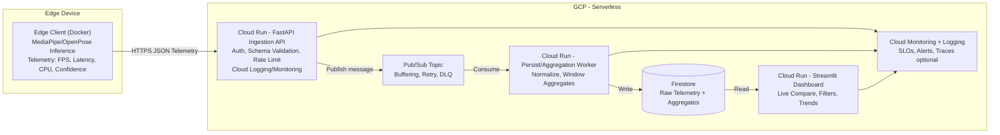

# Projektproposal: Cloud-Native CV Benchmarking Platform

## 1. Ziel des Projekts
Das Ziel ist die Entwicklung einer **hybriden Cloud-Plattform zur systematischen Evaluation und zum Vergleich von Computer-Vision-Modellen**. Wir verbinden ein lokal entwickeltes Modul zur Gesten- bzw. Übungserkennung (**Edge Computing**) mit einer cloudbasierten Analyse- und Visualisierungsschicht. Der Fokus liegt auf dem Vergleich von **MediaPipe vs. OpenPose** unter realistischen Edge-Bedingungen.

Konkret läuft die Bildverarbeitung (MediaPipe vs. OpenPose) lokal auf dem Gerät (Edge), um Bandbreite zu sparen, Latenz zu minimieren und Datenschutz zu gewährleisten. In die Cloud werden **ausschließlich strukturierte Analyse-Ergebnisse (Telemetrie)** wie Latenz, FPS, CPU-Last, Konfidenzwerte und Fehlerindikatoren übertragen. Diese werden zentral gespeichert, aggregiert und live visualisiert.

Der zentrale Erkenntnisgewinn des Projekts besteht darin, **Performance- und Ressourcen-Trade-offs zwischen unterschiedlichen CV-Modellen quantitativ zu bewerten** und gleichzeitig zu demonstrieren, wie eine **cloud-native Telemetrie-Architektur** für Edge-AI-Anwendungen betrieben und skaliert werden kann.

### Was wird neu gebaut vs. was existiert?
* **Existiert:**  
  * Die CV-Frameworks **OpenPose** und **MediaPipe** (aus dem CV-Kurs)  
  * Google Cloud Services (**Cloud Run**, **Firestore**, **Cloud Monitoring**)

* **Wird neu gebaut:**  
  * **Edge Client (Python/Docker):**  
    Ein lokaler Container, der Webcam-Daten verarbeitet, Pose-Erkennung durchführt und standardisierte Telemetrie (z. B. Latenz, FPS, CPU-Auslastung, Konfidenz) erzeugt. Es werden **keine Video- oder Bilddaten** an die Cloud übertragen.
  * **Cloud API (FastAPI):**  
    Ein Microservice zur validierten Entgegennahme der Telemetriedaten, inkl. Schema-Validierung, Session-IDs und Logging.
  * **Asynchrone Ingestion-Komponente:**  
    Entkopplung von Dateneingang und Persistierung (z. B. mittels Cloud-nativer Messaging-Mechanismen), um Robustheit, Retry-Fähigkeit und Skalierbarkeit zu gewährleisten.
  * **Cloud Dashboard (Streamlit):**  
    Eine Webanwendung, die live darstellt, welches Modell aktuell besser performt (z. B. „MediaPipe ist 20 % schneller als OpenPose“) und verschiedene Modell- sowie Cloud-Metriken visualisiert.

---

## 2. High-Level Architektur

Wir nutzen eine **cloud-native Microservice-Architektur** auf Basis von Containern mit klarer Trennung zwischen Edge-Verarbeitung, Ingestion, Persistierung und Visualisierung.

**Ablauf (vereinfacht):**
1. Edge Client führt die Pose-Erkennung durch und erzeugt Telemetrie.
2. Cloud API nimmt die Daten entgegen, validiert sie und protokolliert sie.
3. Asynchrone Weiterleitung zur Persistierung zur Entkopplung der Komponenten.
4. Speicherung der Metriken in Firestore.
5. Dashboard und Monitoring-Komponenten greifen lesend auf die Daten zu.

---

## 3. Beziehung zu Cloud Computing

Das Projekt zeigt eine realistische **Edge-to-Cloud-Architektur**, wie sie in IoT- und ML-Monitoring-Szenarien eingesetzt wird:

* **Edge Computing:**  
  Die rechenintensive CV-Inferenz erfolgt lokal am Gerät, um Latenz und Bandbreitenbedarf zu minimieren.
* **Microservices:**  
  API, Ingestion und Dashboard sind logisch getrennte Services und unabhängig skalierbar.
* **Containerization:**  
  Docker wird sowohl lokal (reproduzierbare CV-Umgebung) als auch in der Cloud (Deployment) eingesetzt.
* **Serverless Computing:**  
  Die Cloud-Komponenten laufen auf Google Cloud Run und skalieren automatisch bis auf Null.
* **Observability & Monitoring:**  
  Nutzung von Cloud Logging und Cloud Monitoring zur Analyse von Latenzen, Fehlerquoten, Durchsatz und Ressourcenverbrauch.

Die Cloud dient damit nicht nur als Hosting-Plattform, sondern als **zentrale Benchmarking-, Analyse- und Betriebsschicht**.
### 3.1 Vorteile der eingesetzten Cloud-Technologien

* **Elastische Skalierung für Edge-Telemetrie:**  
  Cloud Run skaliert API, Worker und Dashboard automatisch mit der Anzahl aktiver Edge-Clients. Lastspitzen (z. B. parallele Benchmarks) werden ohne manuelles Provisioning abgefangen.

* **Entkopplung und Ausfallsicherheit durch Messaging:**  
  Durch eine asynchrone Ingestion (z. B. Pub/Sub) werden Dateneingang und Persistierung getrennt. Burst-Last, temporäre Ausfälle und Retries können robust behandelt werden, ohne dass Edge-Clients blockieren.

* **Reproduzierbare und schnelle Deployments:**  
  Containerisierung und Infrastructure-as-Code (Terraform) ermöglichen konsistente Umgebungen, versionierte Services und schnelle Iterationen, wichtig für experimentelle Benchmarks.

* **Zentrale Beobachtbarkeit und Vergleichbarkeit:**  
  Cloud Monitoring und Logging liefern einheitliche Metriken (Latenz, Fehlerquoten, Durchsatz) über alle Services hinweg und ermöglichen eine konsistente Bewertung der gesamten Edge-to-Cloud-Pipeline.

* **Passendes Betriebs- und Kostenmodell:**  
  Serverless-Services mit Scale-to-Zero minimieren Betriebskosten außerhalb von Testläufen und reduzieren den administrativen Aufwand gegenüber klassischen VM-Setups.

---

### 3.2 Schwierigkeiten und Grenzen des Ansatzes

* **Mehr als „Container + Datenbank“ notwendig:**  
  Ohne Messaging, Aggregation und sauberes Datenmodell skaliert die Architektur nicht sinnvoll. Ein Großteil der Komplexität liegt im **Betrieb** (Retries, Idempotenz, Monitoring), nicht im reinen Deployen eines Containers.

* **Datenmodellierung und Abfrage-Limits von Firestore:**  
  Firestore erfordert vordefinierte Abfragepfade und Indizes. Für Dashboards müssen Aggregationen (z. B. Zeitfenster, Modellvergleiche) explizit vorbereitet werden, sonst entstehen Performance- und Kostenprobleme.

* **Benchmark-Verzerrungen durch Mess-Overhead:**  
  Telemetrie-Erfassung, Serialisierung und Netzwerkübertragung beeinflussen selbst Latenz und FPS. Diese Effekte müssen explizit berücksichtigt und dokumentiert werden.

* **Eventual Consistency und Duplikate:**  
  Asynchrone Systeme können Events mehrfach zustellen. Persistierung muss idempotent sein (z. B. stabile Event-IDs), was die Implementierung komplexer macht.

* **Security und Missbrauchsschutz:**  
  Telemetrie-Endpunkte benötigen Authentifizierung, Quotas und Rate-Limits. Diese Aspekte sind für ein Benchmarking-Projekt leicht zu unterschätzen, aber essenziell.

* **Kostenkontrolle bei hoher Ereignisfrequenz:**  
  Hohe Telemetrie-Raten können zu vielen API-Aufrufen und Datenbank-Writes führen. Batching, Sampling und Aggregation sind notwendig, um Cloud-Kosten beherrschbar zu halten.
---

## 4. Meilensteine

Start der Implementierung nach der Proposal-Abnahme (Weihnachtsferien/Jänner).

| Meilenstein | Beschreibung & Ziel | Deadline (Intern) |
| :--- | :--- | :--- |
| **M1: Cloud Setup** | GCP-Projekt, Terraform-Basis, IAM und Container Registry eingerichtet. | 30.12.2025 |
| **M2: Ingestion Service** | FastAPI-Service mit Schema-Validierung, Authentifizierung und strukturiertem Logging. | 07.01.2026 |
| **M3: Dashboard Skeleton** | Streamlit-App visualisiert Dummy-Daten, Vergleichs-Layout steht. | 14.01.2026 |
| **M4: Integration & Metrics** | Edge-Client sendet reale Telemetrie (FPS, Latenz, CPU). | 21.01.2026 |
| **M5: Cloud Monitoring** | Einbindung von Cloud-Metriken, Test mit mehreren parallelen Edge-Clients. | 28.01.2026 |
| **M6: Finalisierung** | Dokumentation, Benchmark-Auswertung und Präsentationsvorbereitung. | 31.01.2026 |

---

## 5. Aufgabenverteilung

| Teammitglied | Rolle | Verantwortungsbereich |
| :--- | :--- | :--- |
| **Christoph** | **Cloud Backend** | FastAPI, Telemetrie-Schema, Ingestion-Logik, Cloud-Run-Deployment |
| **Simon** | **Infra & Data** | Firestore, Terraform, IAM, Monitoring und Logging |
| **Marco** | **Edge & Viz** | CV-Integration (OpenPose/MediaPipe), Edge-Telemetrie, Streamlit-Dashboard |
