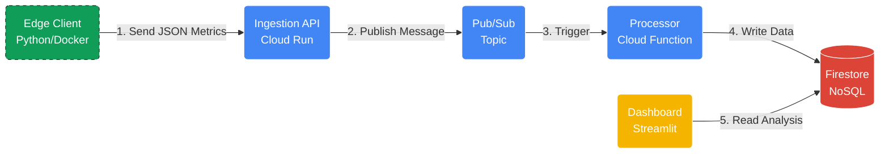

# Projektproposal: Scalable Cloud-Native CV Benchmarking Platform

## 1. Ziel des Projekts
Das Ziel ist die Entwicklung einer hybriden Benchmarking-Plattform für Computer-Vision-Modelle. Wir verbinden ein lokales Edge-Modul, das Gesten/Übungen erkennt (Vergleich MediaPipe vs. OpenPose), mit einer Cloud-native Analyse-Pipeline.

### Architektur-Komponenten
* **Edge Layer:** Ein Docker-Container führt die Bildverarbeitung lokal aus (Privatsphäre & Bandbreite) und extrahiert Metriken.
* **Ingestion Layer:** Eine **FastAPI** auf **Cloud Run** nimmt Daten entgegen.
* **Messaging Layer (Neu):** **Pub/Sub** puffert die eingehenden Nachrichten asynchron.
* **Processing Layer (Neu):** Eine **Cloud Function** wird durch Pub/Sub getriggert, validiert die Daten und schreibt sie in die Datenbank.
* **Presentation Layer:** Ein **Streamlit** Dashboard visualisiert die Performance-Unterschiede live.

## 2. High-Level Architektur

Wir setzen auf eine asynchrone Microservice-Architektur.

## 3. Beziehung zu Cloud Computing

Das Projekt demonstriert moderne Cloud-Patterns:
* **Event-Driven Architecture:** Nutzung von Message Queues (Pub/Sub) zur Systementkopplung.
* **FaaS (Function as a Service):** Granulare Verarbeitung von Events durch Cloud Functions.
* **Infrastructure as Code (IaC):** Bereitstellung der Infrastruktur (Topics, Services, IAM) via Terraform.
* **Edge Computing:** Verlagerung von rechenintensiven Aufgaben (CV Inferenz) auf den Client zur Latenzminimierung.

## 4. Meilensteine

Start der Implementierung nach der Proposal-Abnahme.

| Meilenstein | Beschreibung & Ziel | Deadline |
| :--- | :--- | :--- |
| **M1: Cloud Infra** | Terraform Setup für Cloud Run, Pub/Sub und Firestore steht. | 30.12.2025 |
| **M2: Ingestion Pipeline** | FastAPI nimmt Daten an -> pusht in Pub/Sub -> Cloud Function schreibt in Firestore. (Durchstich der Pipeline). | 07.01.2026 |
| **M3: Dashboard V1** | Streamlit visualisiert Daten aus Firestore. Basis-Layout für Modell-Vergleich steht. | 14.01.2026 |
| **M4: Edge Integration** | Der lokale CV-Client sendet echte Live-Metriken (FPS, Latenz) an die Cloud Pipeline. | 21.01.2026 |
| **M5: Monitoring & Polish** | Alerting für Latenz-Spikes (Cloud Monitoring). Code Cleanup und Dokumentation. | 28.01.2026 |
| **M6: Finalisierung** | Abschlusspräsentation und Demo. | 31.01.2026 |

## 5. Aufgabenverteilung

| Teammitglied | Rolle | Verantwortungsbereich |
| :--- | :--- | :--- |
| **Christoph** | **Cloud Architecture** | Aufbau der **Ingestion API** (Cloud Run) und Konfiguration von **Pub/Sub**. |
| **Simon** | **Backend Logic & Data** | Implementierung der **Cloud Function** (Message Processing), Firestore-Design und Terraform. |
| **Marco** | **Edge & Visualization** | Entwicklung des lokalen **CV-Containers** und Aufbau des **Streamlit Dashboards**. |